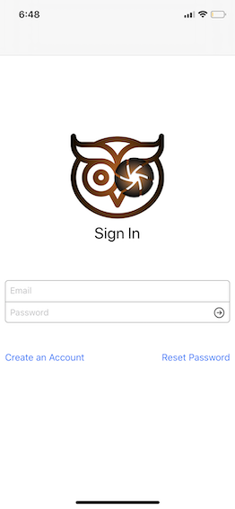
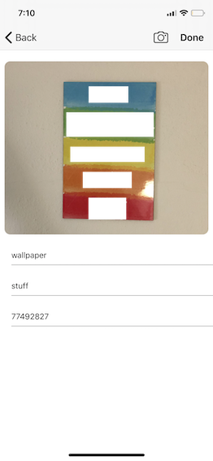
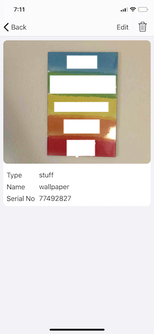

# ARObjectDetection

This is a graduation project.

This app is used to save an object and its information. In this project, the aim is to scan and retrieve object data quickly.

The user adds image/images and other information of the object and these data are saved in the Firebase database.

## ***ARKit technology is used to capture the object.***
 
 
 
 An info button is created on the screen after the scan of the object that exists in the database of the user. This button is used to access the object detail page.
 

Other details about the usage of the app are shown in UI's that be below.

## Add Object

## Object List

## Object Detail

## Profile

## Password operations

